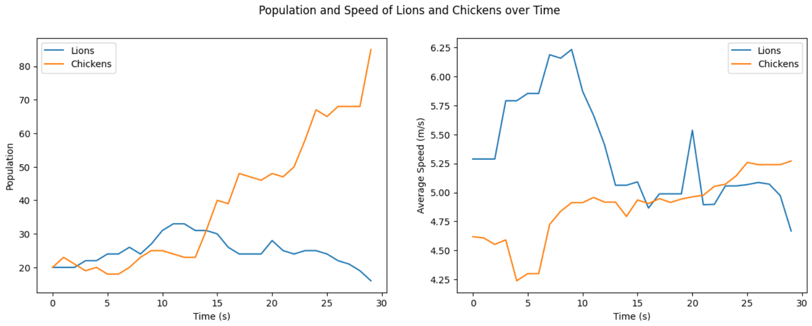

# Unity Ecosystem

A Simple Ecosystem with Lions, Chickens and Grass in Unity.

  

## About

This project simulates a simple prey-predator system: 

Agents lose energy by moving. If their energy is too low, they look for food:

Lions eat Chickens

  

Chickens eat Grass

  

If they have enough energy, they reproduce. The children inherit the average speed of their parents

  

Speed of an agent makes them move faster but also consume energy faster so natural selection finds a compromise.

  

In the above simulation, lions initially have the upper hand in terms of speed and therefore have more population. However, through natural selection, only the faster chickens survive and reproduce. This leads to new chickens being able to outrun lions and leave them with no food which leads to their extinction.

## Package Requirements

This project uses the following non-included packages:
- [PolygonWesternFrontier](https://assetstore.unity.com/packages/3d/environments/historic/polygon-western-frontier-low-poly-3d-art-by-synty-130564)
- [VoxelAnimals](https://assetstore.unity.com/packages/3d/characters/animals/5-animated-voxel-animals-145754)
- [BloodDecalsAndEffects](https://assetstore.unity.com/packages/vfx/particles/blood-gush-73426)